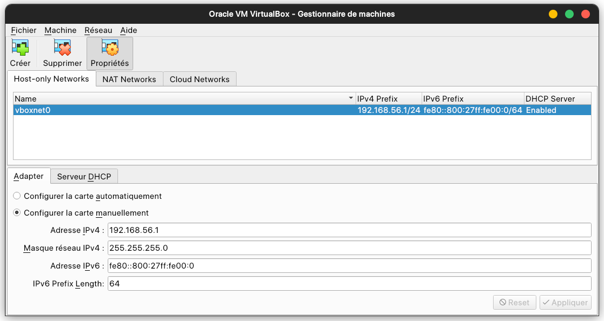
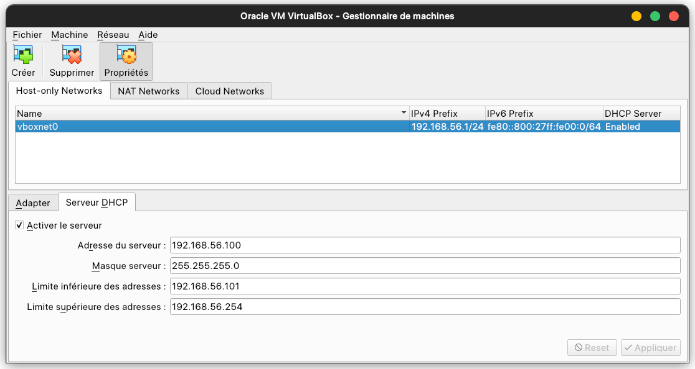
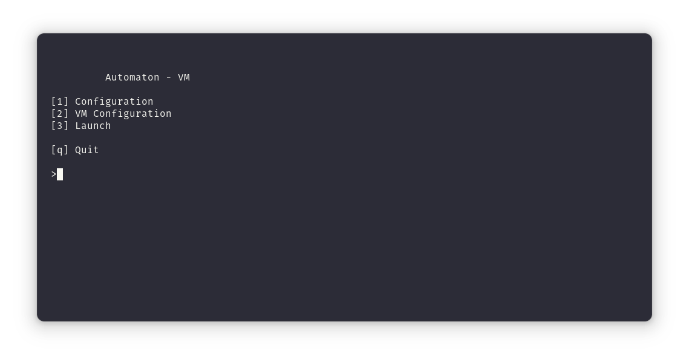
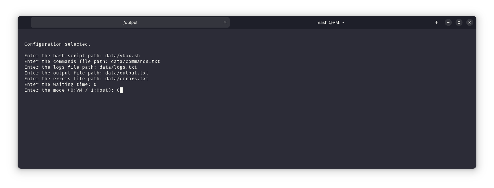
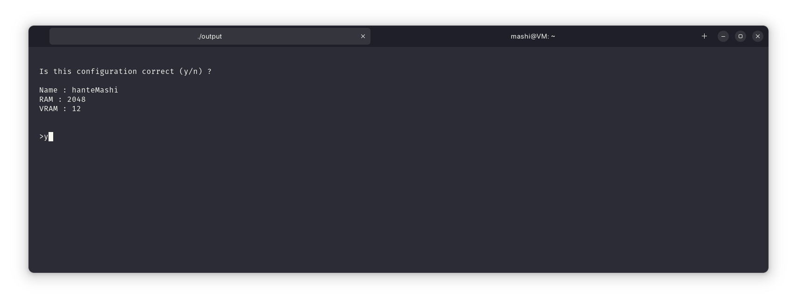
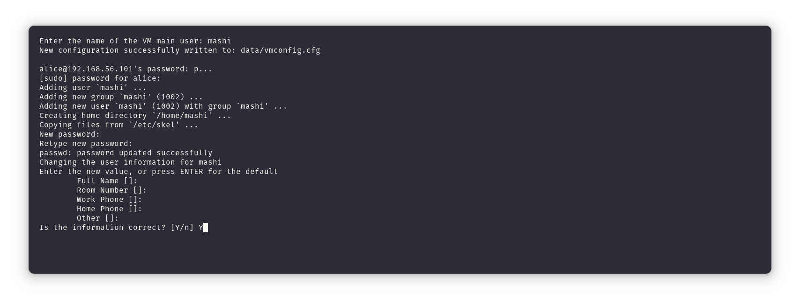
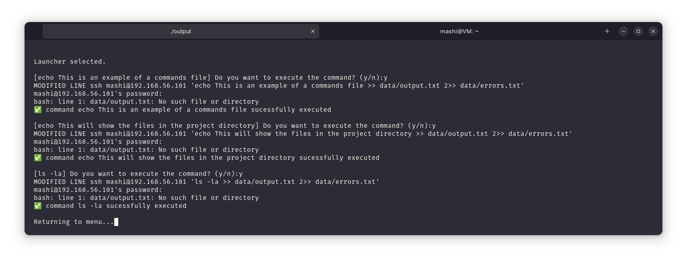

# VM Automaton

This is a project dedicated to creating automatons that can run scripts inside virtual machines or inside the host machine.

## Installation

Install dependencies

```bash
  chmod +x install
  ./install
```
    
## Run locally

Compile and run the program

```bash
  make
  ./output

```

To clean the files
```bash
  make fclean

```

## Features

- Configuration menu (data/config.cfg & data/vmconfig.cfg)
- Execution of commands in a virtual machine or on the host
- Advanced error management and logging system
- Security mode with command verification (y/n)

## Usage

For the program to run, you will need a virtual machine configured with openSSH that will serve as a template machine. You can place this machine inside data/VM with the name "VM" (you can always change the vbox.sh file to your liking for any further modifications).
It is possible to run the commands from the command file on the host machine (1) or on the virtual machine (0). 
In both cases, log files will be created and can be accessed on the respective machines.
Upon its creation, the virtual machine is placed on a NAT network and has the IP address 192.168.56.101 and the user alice (password: alice).
It is therefore necessary to create the NAT network on the Virtualbox application in advance:





## Images 

Menu


File configuration


Virtual machine configuration


Creation of the user on the virtual machine from the host


Execution of the command file on the virtual machine

